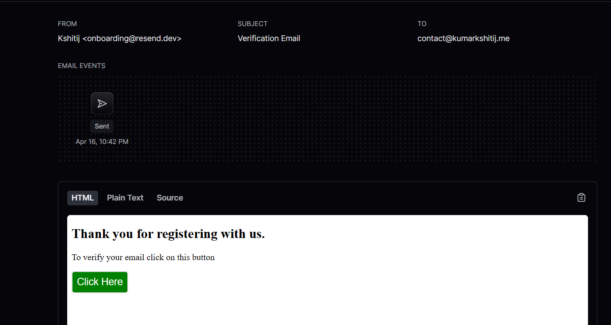

# Getting Started

Clone the repository:

```bash
git clone https://github.com/kumarkshitij171/Authentication-System.git
cd Authentication-System
```

Install dependencies for the backend and frontend:

```bash
cd backend
npm install

cd ../frontend
npm install
```

## Set up environment variables:

Create a .env file in the backend directory and add your MongoDB connection string, Cloudinary credentials, and any other necessary environment variables.
Start the development servers:

```bash
# Start the backend server
cd backend
npm start

# Start the frontend server with Vite
cd ../frontend
npm run dev
```

Access the application in your browser:

Open http://localhost:5173 to view the frontend.

## API Endpoints

- GET /: Returns 'Hello World'.
- POST /api/v1/login: Handles user login.
- POST /api/v1/register: Registers a new user.
- PUT /api/v1/upload-profile-pic: Uploads a user's profile picture using Cloudinary.
- PUT /api/v1/verify-email: Verifies a user's email.
- GET /api/v1/profile: Retrieves user profile information.

## Dependencies Used

- Express.js: For backend server development.
- MongoDB: Database for storing data.
- Cloudinary: Cloud storage for images.
- Bcrypt: For hashing passwords.
- Jsonwebtoken: For generating and verifying JSON Web Tokens.
- Vite: Frontend development server.
- HotToast: For displaying toast notifications.
- useContext: React hook for managing global state.
- Resend: For sending email verification links.

### Email Verification screenshot


